# yart

## description
- Yet another ray tracer.
- A simple [ray tracer](https://en.wikipedia.org/wiki/Ray_tracing_(graphics)) based on [Blinn-Phong reflection model](https://en.wikipedia.org/wiki/Blinn%E2%80%93Phong_reflection_model).

## code
- Code is written in `C++`.
- `include/` & `src/` contains all the src code.
- `examples/` contains some example scene files.
- `textures/` contains texture files.
- `assignments/` contains problem statements from which this raytracer was created.

## documentation
- The documentation for the code is itself.

## demonstration

### comparisions
- In each of the following comparisions, one parameter is changed while keeping all others constant.
- Decreasing `ka` darkens object as it decreases ambient color component.

| 0.9 | 0.7 | 0.5 | 0.3 | 0.1 |
| --- | --- | --- | --- | --- |
| 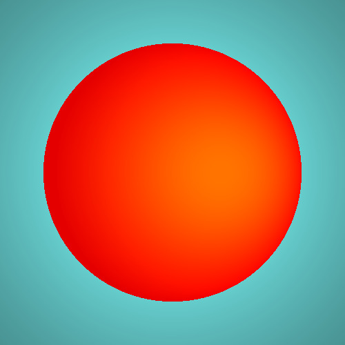 | 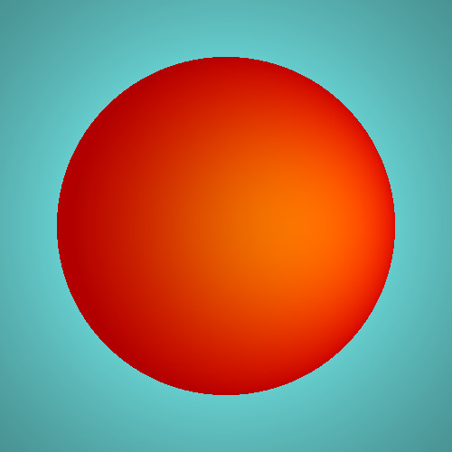 |  | 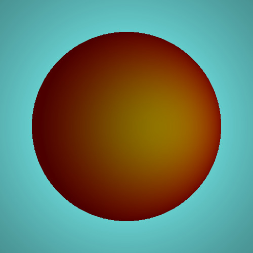 |  |

- Decreasing `kd` darkens object as it decreases diffused color component.

| 0.9 | 0.7 | 0.5 | 0.3 | 0.1 |
| --- | --- | --- | --- | --- |
|  |  |  |  |  |

- Decreasing ks decreases shininess as it decreases reflective color component.

| 0.9 | 0.7 | 0.5 | 0.3 | 0.1 |
| --- | --- | --- | --- | --- |
|  |  |  |  |  |

- Increasing n decreases the size of the reflected spot. As higher powers of a number < 1, viz. coefficient of reflective color, go to zero.

| 2 | 4 | 8 | 16 | 32 |
| --- | --- | --- | --- | --- |
|  | 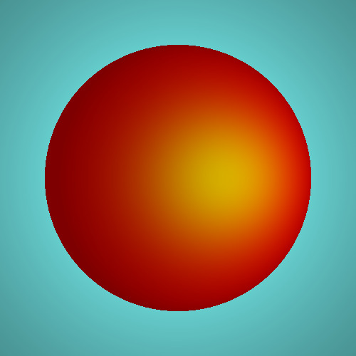 |  |  |  |

- Changing Od changes base ambient and diffused color of object but keeps reflective color same.

| yellow | red | cyan | green | blue |
| --- | --- | --- | --- | --- |
|  |  | 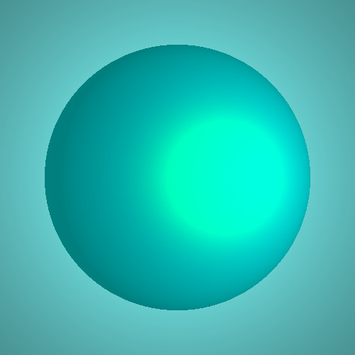 |  |  |

- Changing Os changes reflective color of object but keeps ambient and diffused color same.

| yellow | red | cyan | green | blue |
| --- | --- | --- | --- | --- |
|  |  |  |  |  |

- Point source reflections are more focused than directional source.

| point source (at eye) | directional source (towards view dir) |
| --- | --- |
|  |  |

- Increasing number of lights increases intensity of reflections.

| 1 | 3 | 5 |
| --- | --- | --- |
|  |  |  |

- Changing position of positional light moves the reflection spots towards the light as expected.

| left | down | center | up | right |
| --- | --- | --- | --- | --- |
|  |  |  | 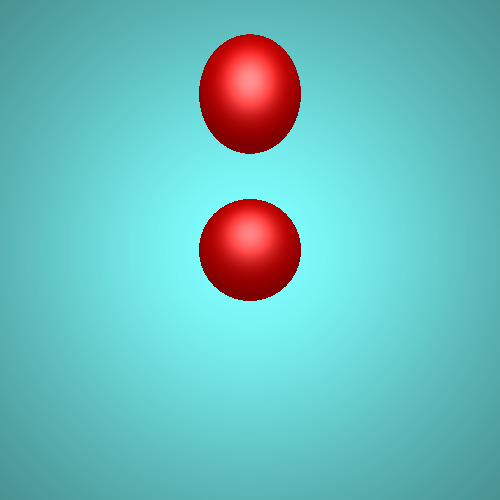 |  |

- Increasing light rgb values increases intensity of diffused, ambient and reflected colors.

| (0.25, 0.25, 0.25) | (.5, .5, .5) | (1, 1, 1) |
| --- | --- | --- |
| 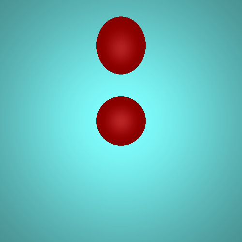 |  |  |

- Soft shadows

| disabled | enabled |
| --- | --- |
| 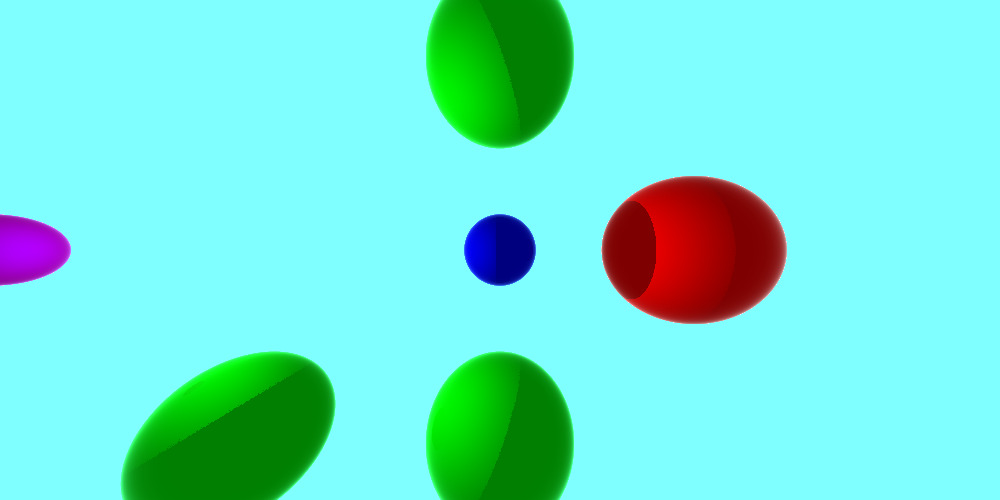 |  |

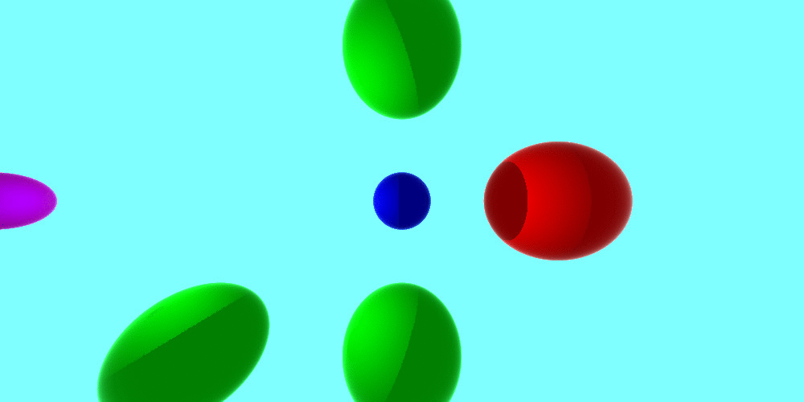

- Vertex normals can be used to add smoothness without changing the mesh. In both of the below images the triangles have exactly same positions. Tuning vertex normals generates illusion of smoothness.

| flat | smooth |
| --- | --- |
|  |  |

- Texture stitching.

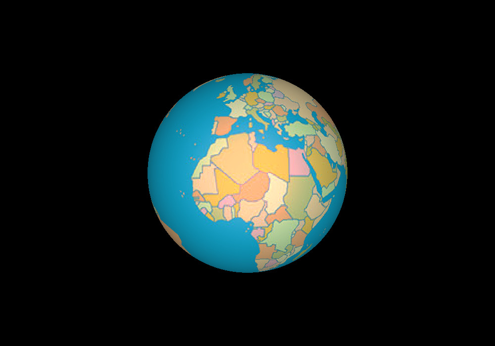

- Viewing distance can be adjusted to focus on objects at that particular distance while blurring out objects at other distances.

| disabled | near focus | far focus |
| --- | --- | --- |
|  |  | 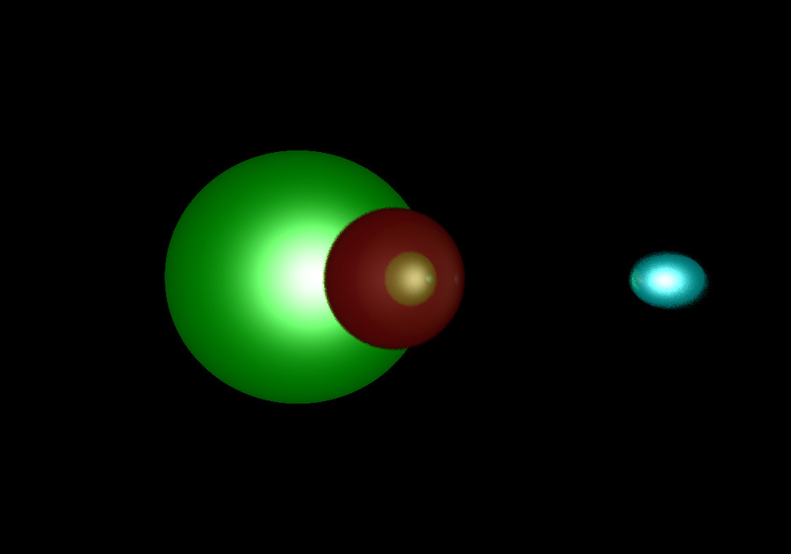 |

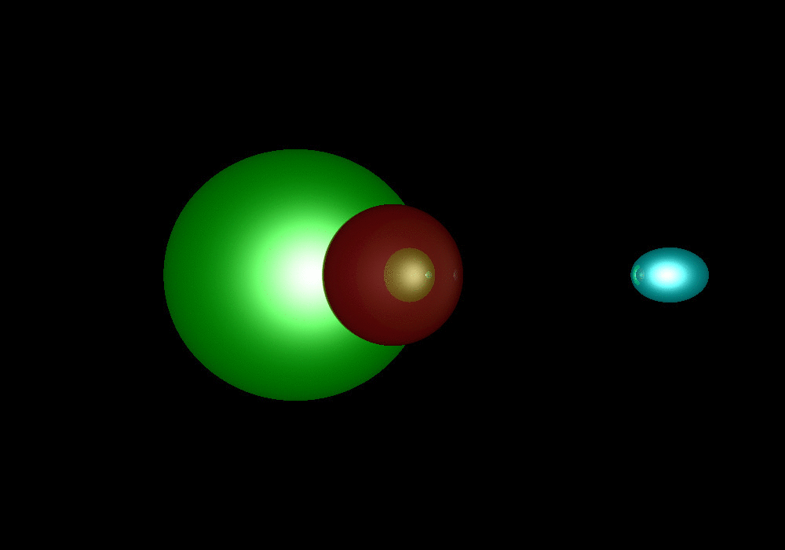

- Parallel projection has no perspective distortion, therefore spheres look like perfect circles.

| parallel | perspective |
| --- | --- |
| 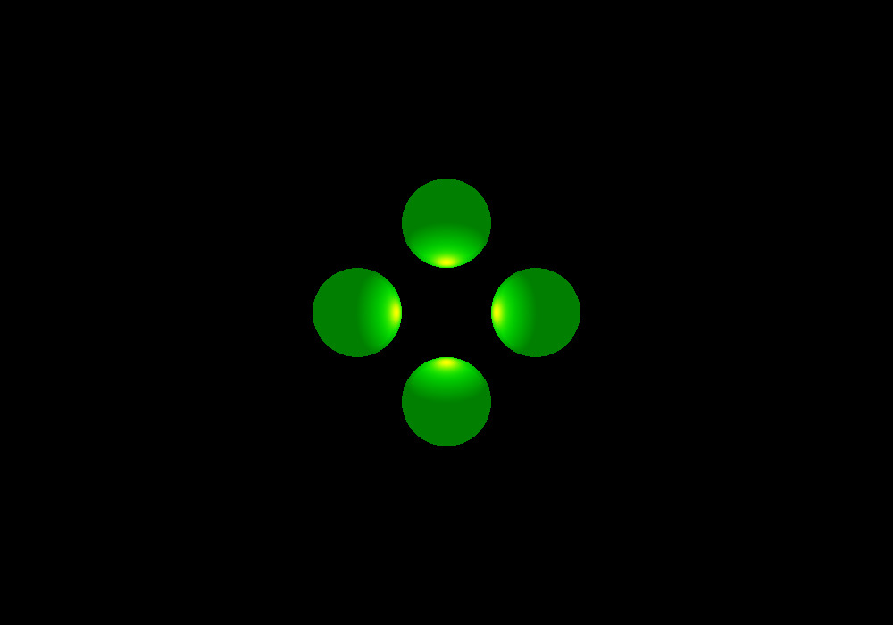 |  |

- A simple reflection scene.

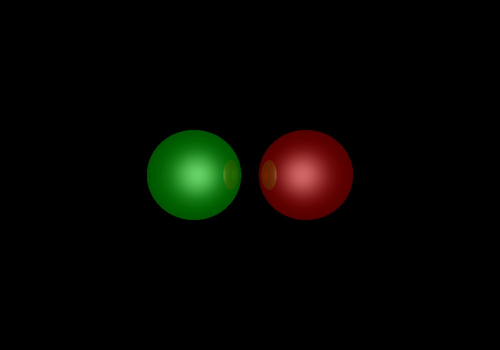

- A refraction scene. Moving the back sphere, moves its image on the font sphere in reverse direction.

| | | |
| --- | --- | --- |
|  | 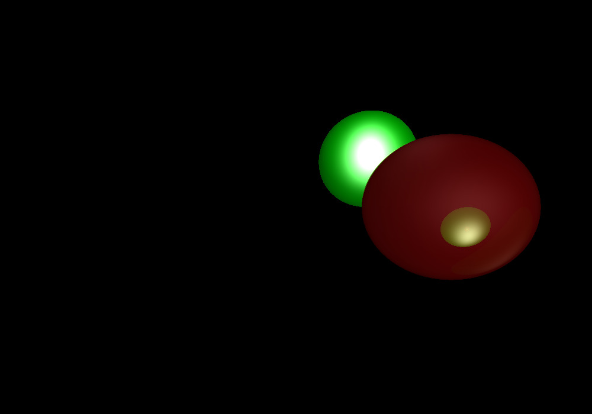 |  |

- A transparent hollow sphere in a colorful room.

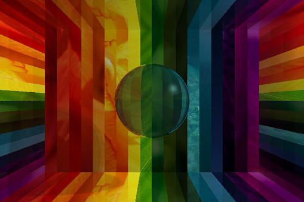

- A transparent sphere of higher refractive index inside another transparent sphere. Increasing inner sphere size increases the shadow it casts (on the bottom left).

- Total internal reflection (TIR). A transparent sphere of refractive index `i` inside another transparent sphere of refractive index `o`.

| i = o (no TIR) | i > o (TIR) |
| --- | --- |
| 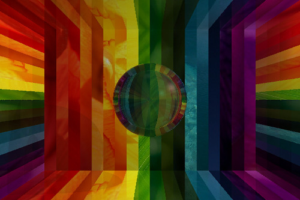 | 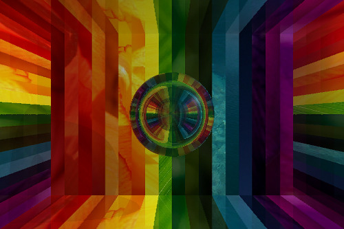 |

- A house.

## usage

### how to run? [linux]
- Compile the raytracer using `make` to create an executable `raytracer`.
- The executable reads a scene file (and possibly some texture files) and generates a `ppm` image.
- Create the image of a scene using `./raytracer <path-to-scene-file>`. It will be in the same directory as the scene file.
    - For example, `./raytracer examples/scene.txt` creates `examples/scene.ppm`.

### format of scene file
- The format is similar to [.obj](https://en.wikipedia.org/wiki/Wavefront_.obj_file) file format.
- Each line a the scene file defines something. Each line starts with a keyword and varying number of space separated parameters can follow.
- All colors are in normalized scale (0 - 1).
- The recognized keywords are as follows.
    - `# ...`: Comment. Will be ignored.
    - `eye x y z`: Camera position.
    - `viewdir x y z`: Camera viewing direction. Must be a unit vector.
    - `updir x y z`: Up direction. Must be a unit vector.
    - `vfov angle`: Vertical field of view in degrees.
    - `imsize width height`: Output image dimensions in pixels.
    - `bkgcolor r g b`: Background color.
    - `light x y z w r g b`: A light source.
        - `x y z` is position.
        - `w` can be 0 (directional source) or 1 (point source).
        - `r g b` is color.
    - `mtlcolor Odr Odg Odb Osr Osg Osb ka kd ks n a h`: Material color.
        - `Odr Odg Odb` is diffusion color.
        - `Osr Osg Osb` is specular color.
        - `ka kd ks` are ambient, diffusion and specular co-efficients respectively in the Blinn-Phong model.
        - `n` is the power in Blinn-Phong model.
        - `a` is opacity level (0 - 1).
        - `h` is refractive index.
    - `texture <path-to-texture-file>`: Path is assumed to start from raytracer executable directory. Has to be a valid `ppm` file.
    - `sphere x y z radius`: A spherical object.
    - `v x y z`: Vertex position.
    - `vt u v`: A texture coordinate. `u` & `v` must be in [0, 1].
    - `vn x y z`: A vertex normal definition. Must be a unit vector.
    - `f ...`: A face of a triangle.
        - All following arguments are indices of previously defined entities. The entities are counted from starting from 1 (and not 0).
        - `f v1 v2 v3`: `v1 v2 v3`: Vertex indices.
        - `f v1/vt1 v2/vt2 v3/vt2`: Vertex indices annotated with texture coordinate indices.
        - `f v1//vn1 v2//vn2 v3//vn3`: Vertex indices annotated with vertex normal indices.
        - `f v1/vt1/vn1 v2/vt2/vn2 v3/vt3/vn3`: Vertex indices annotated with texture coordinate indices & vertex normal indices.
    - `parallel`: Presence indicates that parallel projection is to be used. Default is `perspective`.
    - `viewdist distance`: Viewing distance for depth of field effect.
- Once a material color or texture is defined, it will be used for all the following objects in the scene until another is defined.
- For integer parameters, don't add a succeding decimal part.
    - `1` is ok.
    - `1.` is not okay. `1.0` is not okay.
    - This is caused merely because of the `cin` construct behaviour and has nothing to do with the ray tracer.

### ray tracer configuration
- Ray tracer has some configurable parameters, as listed with the defaults below.

| name | description | default |
| --- | --- | --- |
| CAMERA\_MEDIUM\_REFRACTIVE\_INDEX | Refractive index of medium camera is placed in. | 1 |
| CAMERA\_MEDIUM\_OPACITY | Opacity of medium camera is placed in. | 0 |
| RECURSIVE\_DEPTH | Number of times a ray reflects/refracts. Higher value produces more realistic effects. | 6 |
| SOFT\_SHADOW\_JITTER | Measure of dispersion of shadow rays. Higher value produces softer shadows. | 0 |
| NUM\_SHADOW\_RAYS\_PER\_POI | Number of shadow rays. Higher value produces softer shadows. | 1 |
| NUM\_DISTRIBUTED\_RAYS | Number of rays traced per pixel. Higher value produces more diffused image. | 10 |
| DISTRIBUTED\_RAYS\_JITTER | Measure of dispersion of rays traced per pixel. Higher value produces more diffused image.  | 5e-2 |

- To change config, directly edit these values in `src/main.cpp` and recompile.

## roadmap
### raytracer
- [x] Ray sphere intersection.
- [x] Ray triangle intersection (barycentric coordinates).
- [x] Blinn-Phong reflection model.
- [x] Point and directional source of light.
- [x] Shadows.
- [x] Smooth shadows.
- [x] Subtractive shadows.
- [x] Spheres.
- [x] Triangules.
- [x] Vertex normals, and their interpolation.
- [x] Textures for spheres and triangles, Texture coordinates and their interpolation.
- [x] Recursive ray tracing (using schlick’s approximation of the Fresnel reflectance).
- [x] Refraction.
- [x] Total internal reflection.
- [x] Depth of field effect using distributed ray tracing.
- [ ] Parallel projection (not done properly, pulls the camera extremely far back).
- [ ] Spotlights.
- [ ] Attenuation.

### I/O
- [x] Parser. Recognized keywords, Input validation, Good error messages.
- [x] PPM writer.
- [x] PPM reader for textures.

### misc
- [x] To string for all types.
- [x] Vec3d structure.

### bug fixes
- [x] Invalid number of args fix.
- [x] Output file name fix.
- [x] Accept empty lines.
- [x] Ignore unknown keywords.
- [x] Sometimes your rays go through triangles without detecting the intersection.
- [x] Your texture parser doesnt always work, there might be newlines or whitespace at the end of a line.
- [x] Your shadows aren't correct sometimes.
- [x] texture paths.
- [x] 1c testcases.
- [x] 1d testcases.
